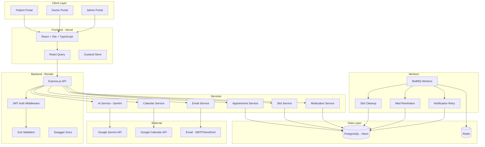
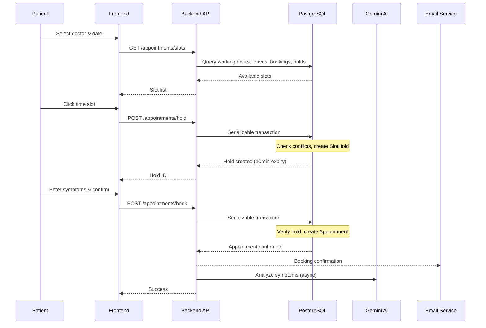
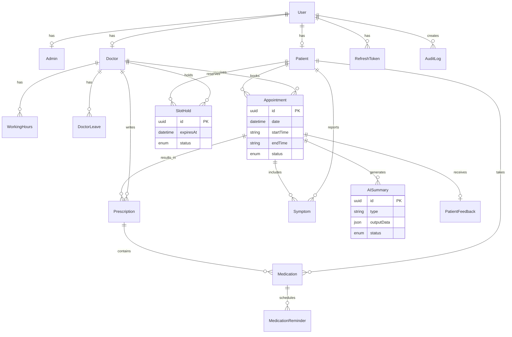

# System Architecture

## High-Level Architecture



## Booking Sequence Diagram



## ER Diagram



## Folder Structure

```
backend/src/
├── config/          # Environment, database, swagger
├── controllers/     # HTTP request handlers
├── middleware/      # Auth, audit logging
├── routes/          # Express route definitions
├── services/        # Business logic layer
│   ├── auth.service.ts
│   ├── appointment.service.ts  # Booking + slots
│   ├── ai.service.ts
│   ├── email.service.ts
│   ├── medication.service.ts
│   ├── calendar.service.ts
│   ├── leave.service.ts
│   └── admin.service.ts
├── validators/      # Zod input schemas
├── workers/         # BullMQ background jobs
└── utils/           # JWT, password, helpers

frontend/src/
├── components/
│   ├── ui/          # shadcn-style components
│   └── layout/      # Dashboard layout, guards
├── pages/
│   ├── admin/       # Admin portal pages
│   ├── doctor/      # Doctor portal pages
│   ├── patient/     # Patient portal pages
│   └── auth/        # Login, register
├── lib/             # API client, utilities
├── stores/          # Zustand auth & theme
└── types/           # TypeScript interfaces
```

## Security Architecture

- **Authentication:** JWT access tokens (15min) + refresh tokens (7d)
- **Authorization:** Role-based middleware (`ADMIN`, `DOCTOR`, `PATIENT`)
- **Transport:** Helmet security headers, CORS whitelist
- **Rate Limiting:** 100 requests per 15 minutes per IP
- **Input Validation:** Zod schemas on all endpoints
- **SQL Injection:** Prisma parameterized queries
- **Password:** bcrypt with 12 salt rounds
- **Audit:** All admin actions logged with IP and user agent
